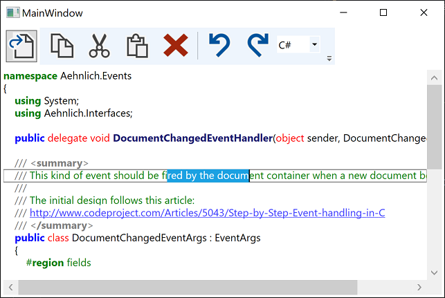
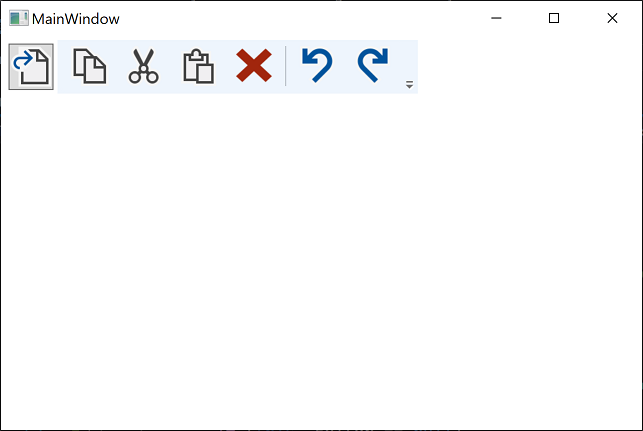

# Overview

This demo project implements the basic features of the 00_MVVMDemo project and adds the

- Highlight Background Current Line Feature

to it.

This feature highlights the current line of the cursor with a horizontal bar that can be
colored in terms of its:

- Background Color
- Border Color and
- Border Thickness.

## Highlight Background Current Line

## Blank Screen without Content

