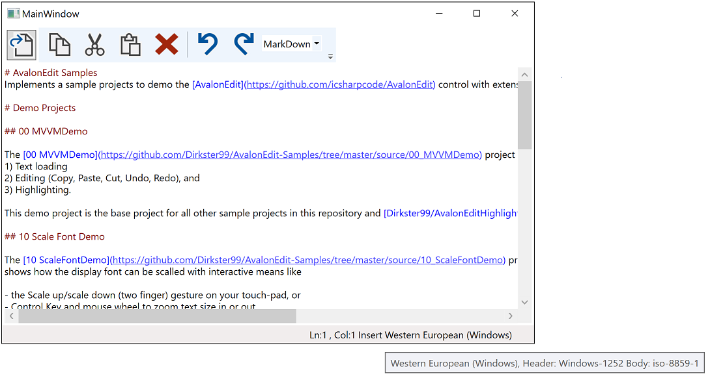
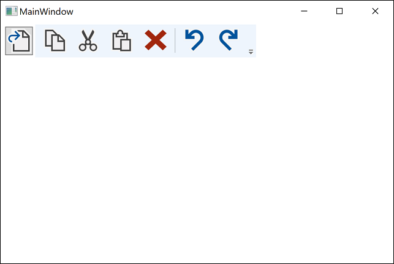

# Overview

This demo project implements the basic features of the 00_MVVMDemo project and adds status display bindings
shown in the lower right corner of the status bar (when a document is loaded)
to it.

Items shown are:
- Cursor position (Ln and Col)
- OverstrikeMode (whether user overwrites available content with next character typed or not)
- Encoding (UTF 8, Western European (Windows), etc) - See also Tool Tip of this element

## Status display with Document Loaded

## Blank Status Bar without Document Loaded

