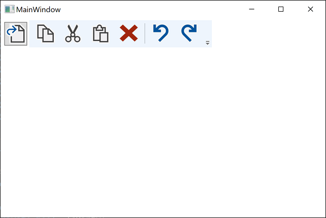
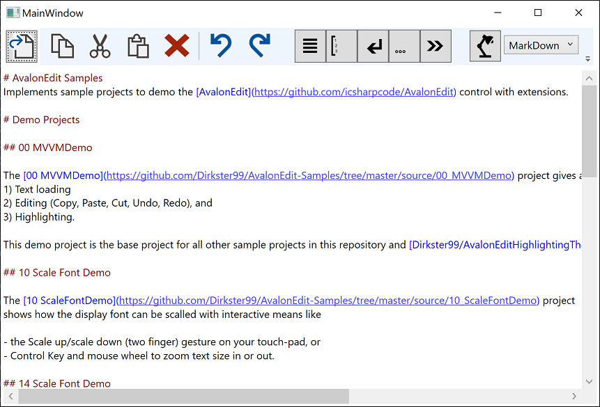

# Overview

This demo project implements the basic features of the 00_MVVMDemo project and adds editing options to:

- toogle Word Wrap
- Toggle Display of Line Numbers
- Toggle display of white spaces, such as, End of Line, Space character, and Tab character

