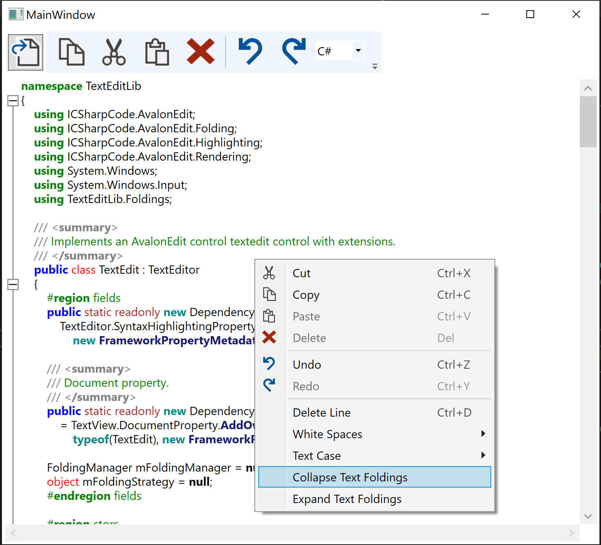
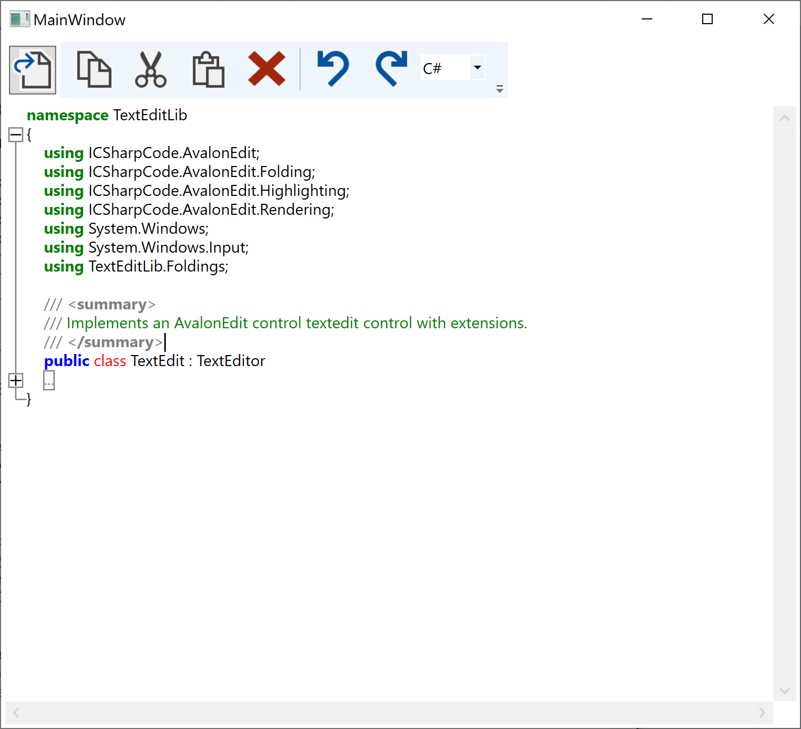
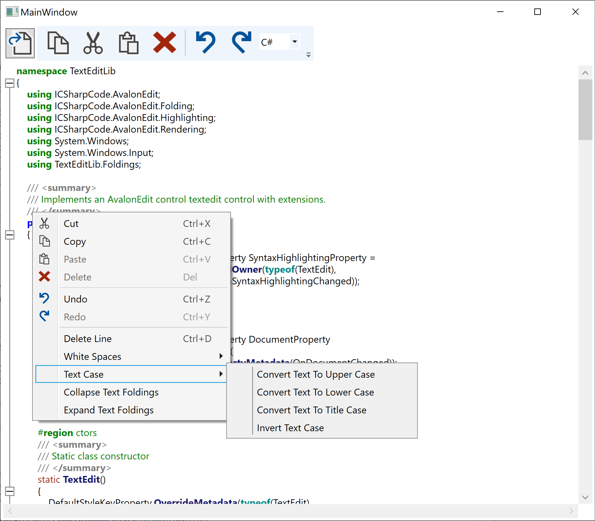
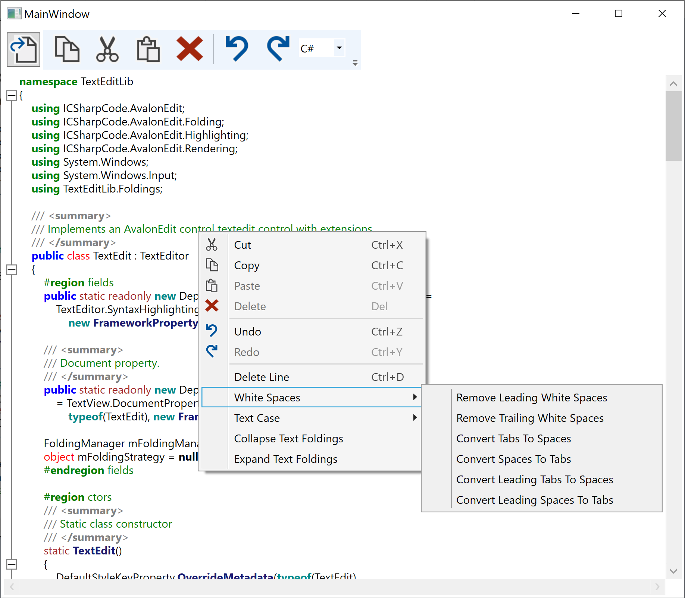

# Overview

This demo project implements the basic features of the 00_MVVMDemo project in a seperate
control library called TextEditLib and adds the followinf features:

- Text Folding for C#, Java, XML, XAML
- Advanced Command Bindings via ContextMenu (Collapse All Text Folds, Expand All Folds)
- Integration of standard AvalonEdit commands, such as, Replace Tabs with Spaces etc.

## Collapsing all Foldings via ContextMenu

## Advanced Commands in ContextMenu

