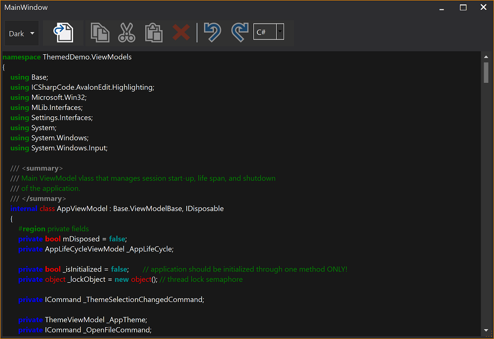
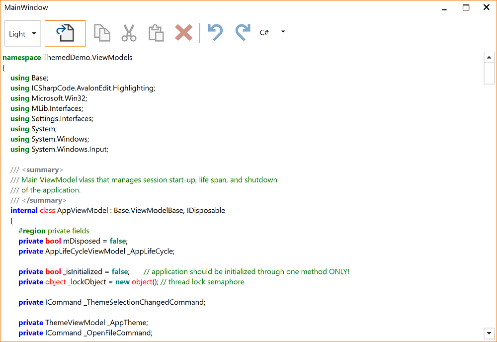

# Overview

This project shows how syntax highlighting can be integrated into WPF Theming without using
custom highlighting definitions per theme.

This solution is just an intermediate step from the MVVM Demo solution to give you an understanding
of what might be necessary to add WPF theming to an existing MVVM application. This demo solution also
shows how bad it is to use highlighting definitions for a Light WPF theme on a Dark WPF theme and vice
versa.

Please refer to
https://github.com/Dirkster99/AvalonEditHighlightingThemes

for an improved solution that coordinates:
1) Dark/Light/True Blue WPF themes
2) with an appropriate Syntax Highlighting Theme.

## Dark Application Theme

## Light Application Theme

